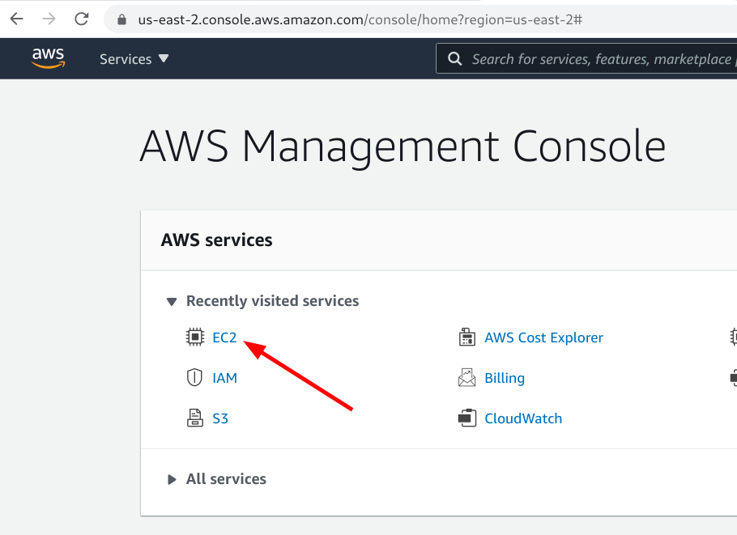
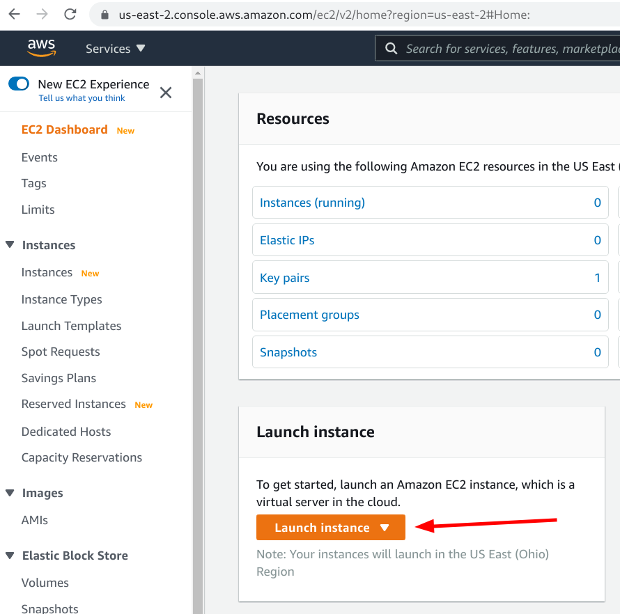
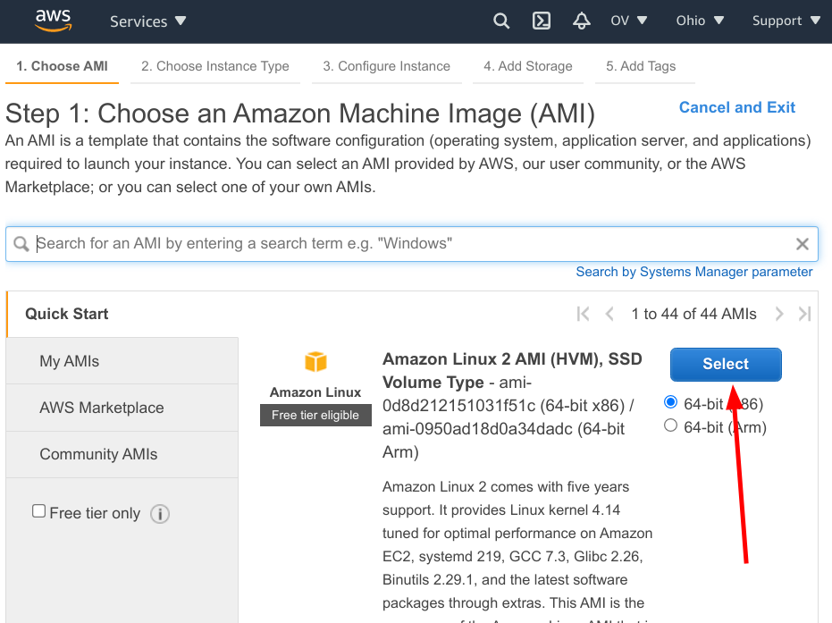
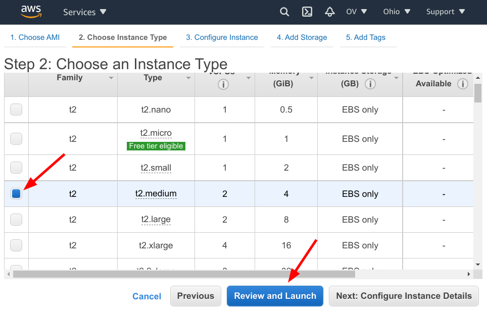
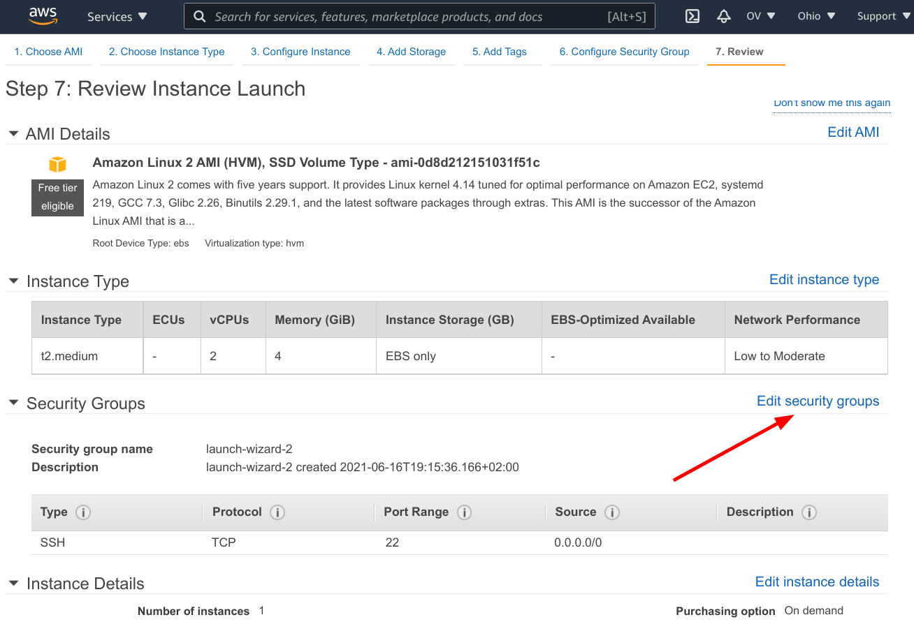
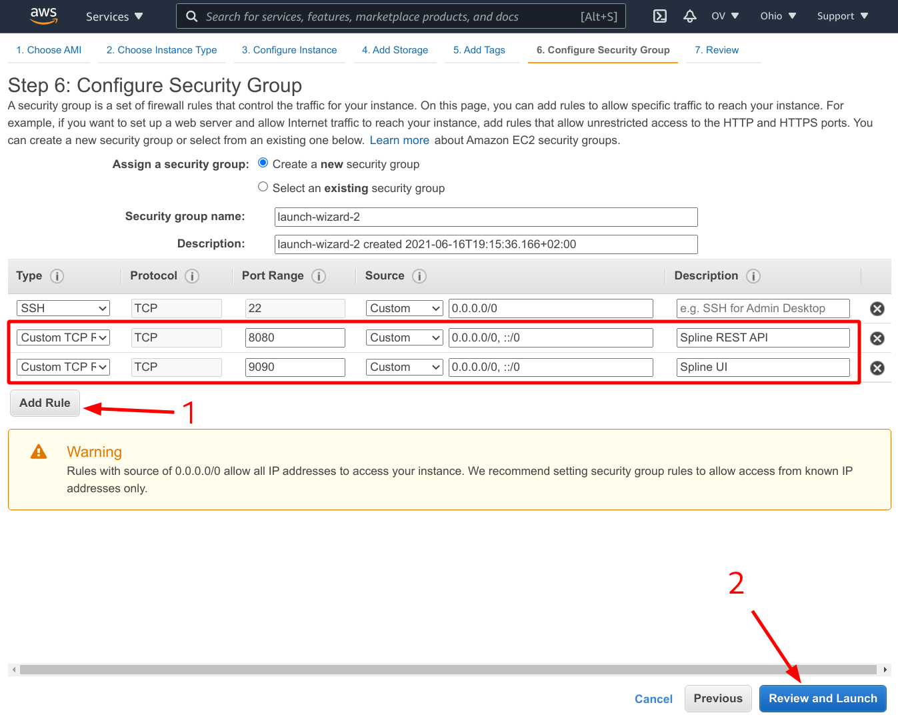
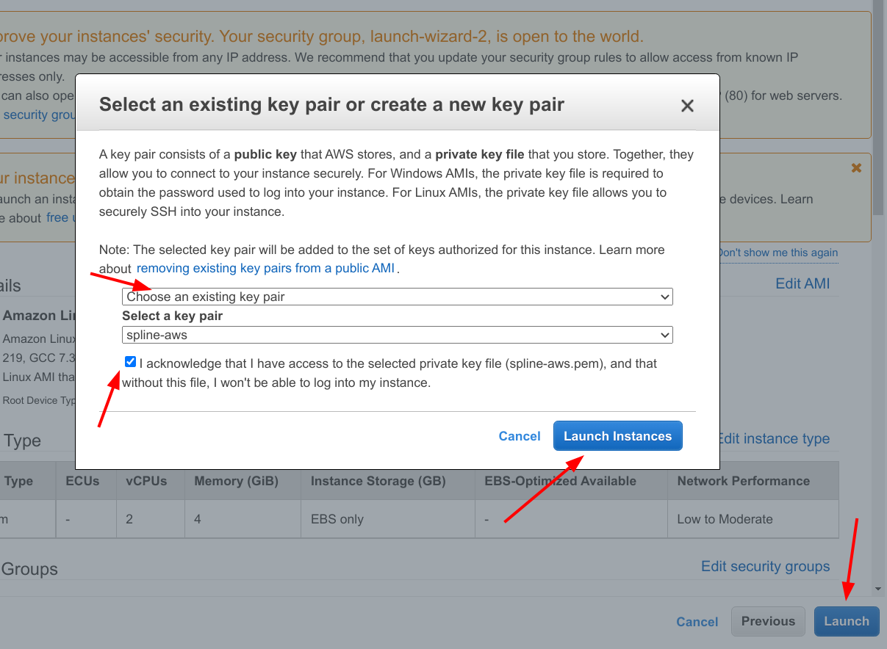
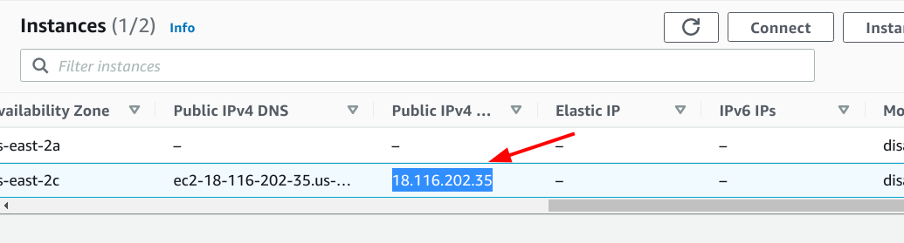

Setting up Spline Server on AWS EC2
===

Spline is an open-source data lineage tracking tool that can help you to capture data lineage of your various data pipelines.
See [Spline GitHub pages](https://absaoss.github.io/spline/) for details.

The purpose of this article is to demonstrate the basic steps that needs to be done to install Spline Server on AWS EC2.

## Disclaimer

This is **NOT** a production setup guide!

The approach described below is just enough for demo and trial purposes, but it doesn't cover majority aspects that needs to be considered when
setting up a real production environment.

## Prerequisites

You need to have an AWS account.

## Create and launch EC2 instance

Open your [AWS Console](https://console.aws.amazon.com/) and select **Launch instance**





Select an Amazon Machine Image of your choice (we'll use a default Amazon Linux 2 AMI)



When choosing an instance type consider the amount of RAM and disk space. You need to run three docker components in total:

- [ArangoDB](https://hub.docker.com/_/arangodb) - this is where the lineage data will be stored.
- [Spline REST Gateway](https://hub.docker.com/r/absaoss/spline-rest-server) - a Java application that exposes API for Spline agents and Spline UI.
  It's running on a Tomcat server and can be greedy for memory. (Alternatively you can use
  [Spline Kafka Gateway](https://hub.docker.com/r/absaoss/spline-kafka-server) instead of the REST one, but this is beyond the scope of this article)
- [Spline UI](https://github.com/AbsaOSS/spline-ui) - a lightweight HTTP server that is only used for serving static resources required by the Spline
  UI. Spline UI is implemented as a Single Page Application (SAP) that fully runs on a user browser, communicates directly to the Spline Gateway via
  the REST API, and does not route main HTTP traffic through its own server side.

For demonstration purposes, we'll run all three containers on the same EC2 instance, so we'll pick `t2.medium` instance with 4Gb RAM and 2 CPUs that
should be enough.



On the **Review Instance** page, check all necessary details. Specifically pay attention to the security group - the instance needs to be open for
public access. You also need to open two custom TCP ports - one for the REST API and the other one for the Spline UI.



We'll use ports `8080` and `9090` for the Spline REST API and the Spline UI respectively.

Then, we can review and launch our instance.



As a final step you'll be asked to create or select a key pair to access the instance via SSH. Follow the AWS instructions.



Take a note of the launched instance IP and store it for the rest of the article.



## Setup Spline

Open the SSH client and log into the instance.

```shell
ssh -i ~/.pem/spline-aws.pem ec2-user@18.116.202.35
```

Then install and start Docker service.

```shell
sudo yum install docker -y
sudo systemctl enable docker.service
sudo systemctl start docker.service
sudo usermod -a -G docker ec2-user
```

Re-login to apply the newly added docker group.

Now we can pull and run Spline containers. You can do it one by one, or use a `docker-compose` to run
a [preconfigured demo setup](https://github.com/AbsaOSS/spline-getting-started/tree/main/docker).

If you want to run individual containers, see the [Step by step instruction](https://absaoss.github.io/spline/#step-by-step).

For the purpose of this article, we will use Docker Compose.

Install Docker Compose:

```shell
sudo curl -L https://github.com/docker/compose/releases/download/1.21.0/docker-compose-`uname -s`-`uname -m` | sudo tee /usr/local/bin/docker-compose > /dev/null
sudo chmod +x /usr/local/bin/docker-compose
```

Download Spline demo Docker-compose config files:

```shell
mkdir spline
cd spline

wget https://raw.githubusercontent.com/AbsaOSS/spline-getting-started/main/docker/docker-compose.yml
wget https://raw.githubusercontent.com/AbsaOSS/spline-getting-started/main/docker/.env
```

Run `docker-compose` like below. `DOCKER_HOST_EXTERNAL` is the external IP of this EC2 instance. This IP will be passed to the Spline UI and used by
the client browser to connect to the Spline REST API.

```shell
DOCKER_HOST_EXTERNAL=18.116.202.35 docker-compose up
```

The given Docker Compose config also runs a set of Spark examples to pre-populate the database. You can either ignore them, or disable them by
commenting out the `agent` service block in the `docker-compose.yml` file:

```yaml

#  agent:
#    image: absaoss/spline-spark-agent:${SPLINE_AGENT_VERSION}
#    network_mode: "bridge"
#    environment:
#      SPLINE_PRODUCER_URL: 'http://172.17.0.1:${SPLINE_REST_PORT}/producer'
#    links:
#      - spline

```

When the containers are up we can verify that the Spline Gateway and Spline UI servers are running by visiting the following URLs:

- http://18.116.202.35:8080/
- http://18.116.202.35:9090/

(Use the correct EC2 instance IP).

---

    Copyright 2019 ABSA Group Limited

    you may not use this file except in compliance with the License.
    You may obtain a copy of the License at

        http://www.apache.org/licenses/LICENSE-2.0

    Unless required by applicable law or agreed to in writing, software
    distributed under the License is distributed on an "AS IS" BASIS,
    WITHOUT WARRANTIES OR CONDITIONS OF ANY KIND, either express or implied.
    See the License for the specific language governing permissions and
    limitations under the License.
