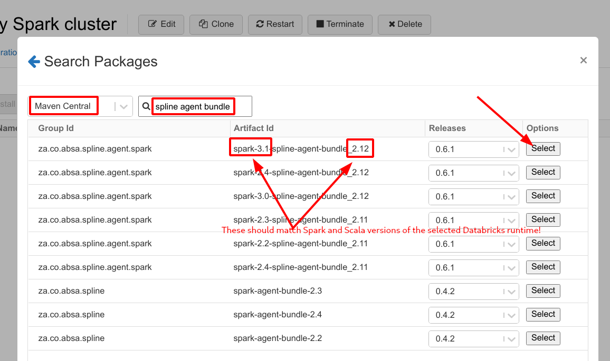

Running Spline on Databricks
===

Spline is an open-source data lineage tracking tool that can help you to capture data lineage of your various data pipelines.
See [Spline GitHub pages](https://absaoss.github.io/spline/) for details.

In this article, I will demonstrate how to create a minimal Spline set up, and capture data lineage of Spark jobs running on a Databricks Notebook.

## Preparation

### Install and launch Spline server components

First, we need to decide where we will run a Spline Gateway. The Spline Gateway is a server part which is responsible for storing and aggregating
lineage metadata captured by Spline agents. It is not strictly required though, as the Spline agent can capture and send the lineage data in Spline
format to any destination, including storing it on S3, HDFS or senfing it to your custom REST API for further processing. However, to fully benefit
from all Spline features (like Spline UI and other features that will come with future Spline versions), the Spline server needs to be installed.

The simplest way of doing it is using Docker. Since all Spline components are available as Docker, you can run it on any environment that supports
Docker. The only requirement is that Spline REST API should be accessible from the node where Spark driver is executing. For the purpose of this
article we will create a public AWS EC2 instance and run Spline docker containers there.

See [Spline on AWS - demo setup](../spline-on-AWS-demo-setup/README.md)
Make sure the Spline REST Gateway and the Spline UI servers are running and take note of the _Spline Producer API URL_. It can be found on the Spline
Gateway index page.


### Prepare a Databricks account

You need to have a Databricks account. In this article, we will use a free account
on [Databricks Community Edition](https://community.cloud.databricks.com/login.html)


## Enable Spline on a Databricks cluster

Create a new cluster on the **Compute** page


Pick a desired Databricks runtime and take a note of the selected Spark and Scala versions. Then, go to the **Spark** tab and add required Spline
configuration parameters.


Here we instruct Spline agent to use the embedded `http` lineage dispatcher and send the lineage data to out Spline Gateway. Use the _Producer API
URL_ copied in the previous step.

```yaml
spark.spline.lineageDispatcher http
spark.spline.lineageDispatcher.http.producer.url http://18.116.202.35:8080/producer
```

You can optionally set the Spline mode to `REQUIRED` if you want Spline pre-flight check errors to be propagated the Spark jobs. It is useful to
minimize the chance for the Spark jobs to complete without capturing lineage, for example due to Spline misconfiguration.

```yaml
spark.spline.mode REQUIRED
```

Refer the [Spline agent configuration](https://github.com/AbsaOSS/spline-spark-agent#configuration) section for details about other config parameters
available.

Now click **Create Cluster** and go to the **Libraries** tab, where we'll proceed with installing Spline agent.


If you have a Spline agent JAR file you can upload it, otherwise you can simply use Maven coordinates, so the agent will be downloaded automatically
from the Maven Central repository.


Click **Search Packages**, select **Maven Central** and type "_spline agent bundle_" into the query text field. You'll get a list of available Spline
agent bundles compiled for different Spark and Scala version.

**Important**: Use a Spline agent bundle that matches the Spark and Scala version of the selected Databricks runtime.



Then click **Install** button.


The cluster is ready to use, so we can create a new Notebook and start writing our test Spark job:


We're almost ready to run some Spark jobs. The last step we need to do is to enable linage tracking on the Spark session.

```scala
import za.co.absa.spline.harvester.SparkLineageInitializer._

spark.enableLineageTracking()
```

This step has to be done once per Spark session. It could also be done via setting the `spark.sql.queryExecutionListeners` Spark property in the Spark
cluster configuration (see https://github.com/AbsaOSS/spline-spark-agent#initialization), but unfortunately it doesn't work on Databricks. When the
Databricks cluster is booting, the Spark session initializes _before_ the necessary agent library is actually installed on the cluster, resulting in
a `ClassNotFoundError` error, and the cluster fails to start. The workaround is to call `enableLineageTracking()` method explicitly. At the time of
calling that method the Spark session is already initialized and all necessary classes are loaded.

Now, just run some Spark code as usual.

We'll use the following example that consists of two jobs. First let's create and save two sample files.

```scala
case class Student(id: Int, name: String, addrId: Int)

case class Address(id: Int, address: String)

Seq(
  Student(111, "Amy Smith", 1),
  Student(222, "Bob Brown", 2)
).toDS.write.mode("overwrite").parquet("/students")

Seq(
  Address(1, "123 Park Ave, San Jose"),
  Address(2, "456 Taylor St, Cupertino")
).toDS.write.mode("overwrite").parquet("/addresses")
```

In the next job, let's read those files, join them and write the result into another file using `append` mode:

```scala
val students = spark.read.parquet("/students")
val addresses = spark.read.parquet("/addresses")

students
  .join(addresses)
  .where(addresses("id") === students("addrId"))
  .select("name", "address")
  .write.mode("append").parquet("/student_names_with_addresses")
```

**Note**: Spline agent only tracks persistent actions that result in data written to a file, a table or another persistent location. For example, you
will not see lineage of memory-only actions like `.show()` or `.collect()`

To see the captured metadata, go to the Spline UI page.


If everything is done correctly, you should see three execution events that correspond to three writes in our example. To see the lineage overview of
the data produced by a particular execution event, click on the event name.


The graph above represents the high-level lineage of the data produced by the current execution event. It basically shows how the data actually flew
between the data sources and what jobs were involved in the process.

To see the details of a particular job (execution plan) click on the button on the corresponding node.


Here you can see what transformations has been applied on the data, the operation details, input/output data types etc.

---

    Copyright 2019 ABSA Group Limited

    you may not use this file except in compliance with the License.
    You may obtain a copy of the License at

        http://www.apache.org/licenses/LICENSE-2.0

    Unless required by applicable law or agreed to in writing, software
    distributed under the License is distributed on an "AS IS" BASIS,
    WITHOUT WARRANTIES OR CONDITIONS OF ANY KIND, either express or implied.
    See the License for the specific language governing permissions and
    limitations under the License.
